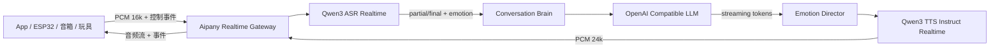
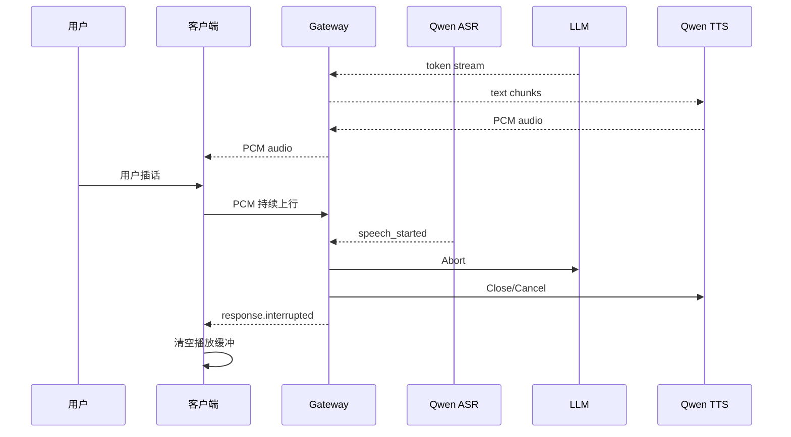

# Aipany 级联 Realtime Voice 架构 v0.1

## 数据面

## 第一版边界

- 客户端与 Aipany 使用单条 WebSocket 长连接。
- 上行二进制帧固定为 `PCM S16LE / 16kHz / mono`。
- 下行二进制帧固定为 `PCM S16LE / 24kHz / mono`。
- JSON 负责会话、转写、文本增量、打断和错误事件。
- 千问 ASR 负责服务端 VAD、实时转写和基础情绪识别。
- LLM 使用 OpenAI-compatible `/chat/completions` SSE 流式接口，便于接中转站。
- 千问 TTS 使用 `qwen3-tts-instruct-flash-realtime`，按用户情绪选择每轮语音 instructions。
- 用户再次开口时，网关立即取消当前 LLM 和 TTS，并下发 `response.interrupted`；客户端收到后必须立即清空本地播放队列。

## 打断时序

## 后续演进

1. 加入设备鉴权、短期 Session Token 和产品策略。
2. 将 ASR、LLM、TTS 抽象为可后台配置的 Provider Registry。
3. 增加 Redis 会话状态、PostgreSQL 配置和用量账单。
4. 增加知识库、工具调用、长期记忆和上下文摘要。
5. 为移动端增加 WebRTC 接入层，为 ESP32 保留 WebSocket/UDP 音频通道。
6. 增加 AEC、抖动缓冲、端到端延迟指标和用量统计。
